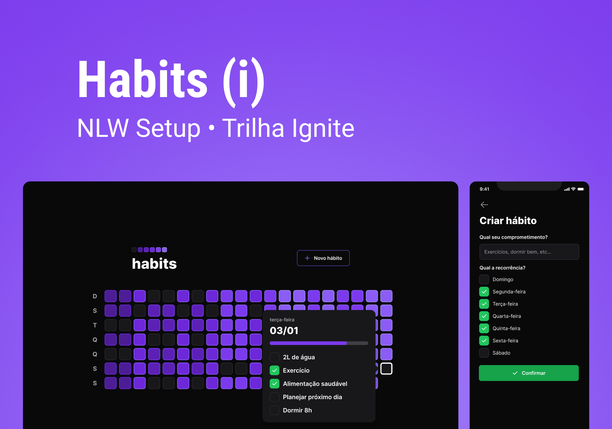

# nlw-setup-habit

<!---Esses são exemplos. Veja https://shields.io para outras pessoas ou para personalizar este conjunto de escudos. Você pode querer incluir dependências, status do projeto e informações de licença aqui--->

Projeto desenvolvido no evento NLW da rocketseat, com intuito de proporcionar ao usuário o controle de seus hábitos diários.

## ☣ Tecnlogias utilizadas

### 🟡 Backend
- Fastify
- Typescript
- Prisma ORM

### 🔵 Frontend
- React
- Typescript
- Tailwind
- Radix-ui

### 🟢 Mobile
- React-native
- Typescript
- Tailwind

## 😄 Sobre o repository

Neste repository você poderá acessar o código do backend, frontend e mobile.
